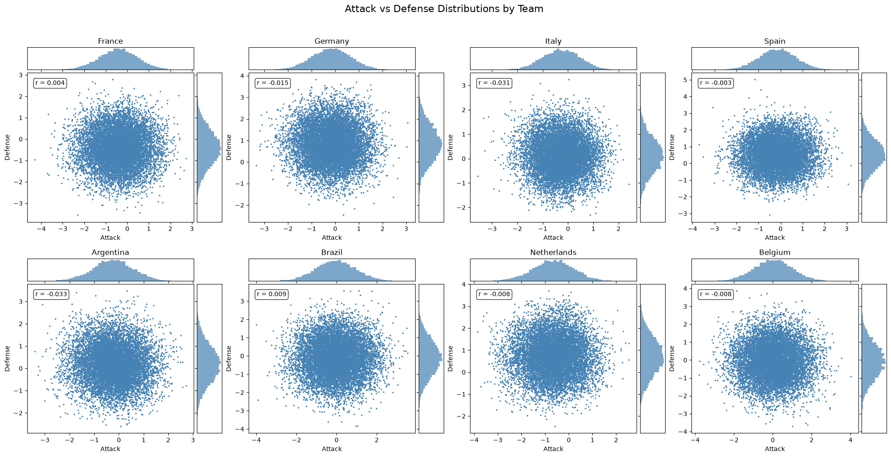

# SMC implementation of the Bivariate Poisson model for football scores

This directory contains a SMC implementation of the Bivariate Poisson model for football scores following the framework in `../../README.md`.

```python
smc_filter = build_filter(
    init_sample=partial(
        init_sample,
        num_teams=num_teams,
    ),
    propagate_sample=propagate_sample,
    log_potential=log_potential,
    n_filter_particles = N,
    resampling_fn=resampling_fn,
)
```

## Models

$$p(x_{1:F} | y_{1:T}) = p(x_i, x_j | y_{1:T}) p(x_{k, k \neq i, j} | x_i, x_j, y_{1:T})$$

### Gaussian Moments Filter

### SMC

### Factorial SMC

Factorial SMC further factorizes the model into independent SMC filters for each team by assuming that each team's latent state is independent of others given the observations.

$$p(x_i, x_j | y_{1:T}) = p(x_i | y_{1:T}) p(x_j | y_{1:T})$$

### Rao-Blackwellized SMC

$$p(x_{1:F} | y_{1:T}) = p(x_{k, k \neq i, j} | x_i, x_j, y_{1:T}) p(x_i, x_j | y_{1:T})$$

### Rao-Blackwellized SQMC


### Comparison table

- Gaussian Moments and Factorial SMC lose the cross team correlation by decoupling the cross-correlation between teams. 3.4.1 Decoupling approximation
- Rao-Blackwellized SMC retain the cross-team correlation 

## To Do List

- [X] Implement SMC filter for the Bivariate Poisson model for football scores.
- [X] Perform diagnostics on SMC filter results - does not seem that accurate? partly because low particle count (N=250)
- [X] Build factorial SMC model for bivariate poisson.
- [X] Perform diagnostics on factorial SMC filter results
- [X] Implement smoothing for factorial SMC filter
- [ ] Compare factorial SMC filter with Gaussian Moments Filter (compare distributions, whether Gaussian Moments Filter approximates SMC (true) distribution well)
- [ ] Compare performance of factorial SMC compared to Gaussian Moments Filter (Log-normalizing constant, predictive accuracy, etc.)
- [ ] Details for Gaussian Moments, Factorial SMC, Rao-Blackwellized SMC, Rao-Blackwellized SQMC
- [ ] Implement SQMC
  - [ ] QMC generator
  - [ ] Hilbert sorting - follow adrien's example
- [ ] Perform diagnostics on SQMC results
- [ ] Compare performance of SQMC, Factorial SMC and Gaussian Moments Filter

**210626** 
- Built SMC filter `model_smc.py`
  - Experiencing weight degeneracy issues. Max number of particles is 250. Used a shorter time frame (2000-01-01 to 06-11-2026) to reduce memory usage.
  - particle filter is sampling 2 x (1 x 2) x N = 4N particles at each time step. Currently, highest number N I tried is 250.

**220626**
- Implement factorialized SMC filter: each team's particle filter is independent of the others
- ran on `N=10000` from `2000-01-01` to `2026-06-11`. computation is more efficient, so then naturally there are results from this. not sure why England / Portugal has nan values? even though they should have played matches.
  - 


**290626**
- Implement prediction and diagnostics for factorial SMC

**300626**
- Implement smoothing for factorial SMC
  - outputs in `scripts/smc/fact_smc/output/factsmc_smoothing_params.json`
  - design choices:
    - `max_transitions` - total transitions across all teams looked back for smoothing. Uses **stratified sampling** to ensure proper representation from all teams. Each team contributes equally (up to their available transitions), with the most recent transitions sampled from each team.
    - `max_matches` - total matches across all teams looked back for smoothing. Supports:
      - Integer (≥1): Use that many matches (e.g., `max_matches=100`)
      - Percentage (0-1): Use fraction of total matches (e.g., `max_matches=0.01` for 1%)
      - `-1`: Use all matches
  - **Implementation Details** (`smoothing_factsmc.py`): The smoothing EM algorithm alternates between:
    1. **E-step**: Run forward factorial SMC filter + backward smoothing for each team independently
    2. **M-step**: Update parameters using smoothed state distributions
      **M-step Parameter Updates:**
      
      | Parameter | Update Method | Sampling Strategy |
      |-----------|---------------|-------------------|
      | `kappa` (dynamics) | Gradient descent on OU transition likelihood | Stratified sampling across teams |
      | `alpha`, `beta` (observation) | Gradient descent on bivariate Poisson likelihood | Most recent matches |
      | `friendly_scale`, `neutral_scale` | Gradient descent with scaled loss | Sampled matches by type |
      | `init_mean`, `init_cov` | Closed-form from smoothed initial states | All teams |
    
    **Loss Function for Scales:**
    $$\text{loss} = -\frac{1}{N}\left(\sum_{\text{regular}} L_i + \frac{\sum_{\text{friendly}} L_j}{s_f} + \frac{\sum_{\text{neutral}} L_k}{s_n}\right)$$
    
    where $s_f$ = friendly_scale, $s_n$ = neutral_scale. Higher scales downweight those match types.
    **Stratified Sampling for Transitions:**
    - Organizes transitions by team_id in a dictionary
    - Distributes `max_transitions` evenly across all teams with transitions
    - Takes most recent transitions from each team
    - Ensures representation from teams with few games
  - Interpretation
    - Kappa $\kappa$ increased dramatically (0.01 to 0.60): Teams' skills revert to mean much faster than initially estimated. This suggests team strengths are more volatile than the initial guess.
    - Alpha $\alpha$ turned negative (0.2 to -0.22): The home advantage parameter became negative, which is interesting - it might indicate that in this dataset, home teams don't have an advantage, or the model is capturing other dynamics.
    - Beta $\beta$ increased (-4.0 to -3.25): Higher baseline for expected goals.
    - Scales increased: Both friendly ($s_{\text{friendly}}$) and neutral ($s_{\text{neutral}}$) scales increased, meaning these match types get downweighted more in the likelihood (higher scale = less weight).

**010726**
- Online particle smoothing: Duffield S., & Singh S. S. (2022). Online particle smoothing with application to map-matching. IEEE Transactions on Signal Processing, 70, 497–508. https://doi.org/10.1109/TSP.2022.3141259